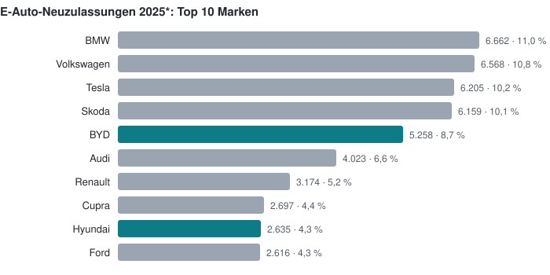
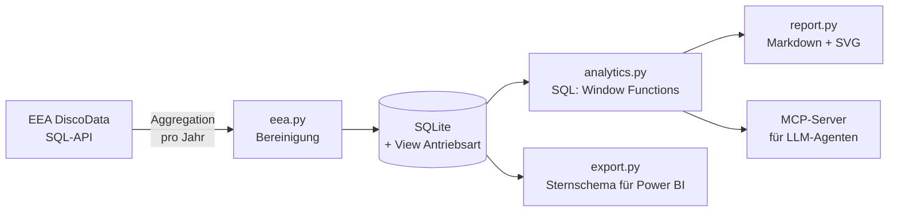

# Auto-Markt Österreich

Pkw-Neuzulassungen in Österreich 2021–2025 aus den offenen Daten der Europäischen Umweltagentur (EEA):
eine kleine Datenpipeline, SQL-Analysen, ein **MCP-Server**, über den ein LLM-Agent Fragen zum Markt
beantwortet, und ein automatisch erzeugter [Marktbericht](report/marktbericht.md).
Im Fokus stehen die Importmarken **Hyundai, MG, BYD und Mitsubishi**.



## Was die Daten zeigen

- **E-Autos wachsen, Hybride noch schneller.** Der E-Anteil stieg von 13,9 % (2021) auf 21,3 % (2025\*),
  nach einem Rückgang 2024 auf 17,6 %. Vollhybride legten im selben Zeitraum von 16,2 % auf 29,2 % zu.
- **BYD:** von 1.023 Zulassungen (2023) auf 3.938 (2024) und 6.895 (2025\*). 2025 Platz 5 bei E-Autos
  mit 8,7 % Anteil; der Sealion 7 ist nach dem Tesla Model Y das zweithäufigste neue E-Auto.
- **MG:** wächst weiter (+36 % 2025\*), aber der E-Anteil fiel von 82 % (2023) auf 8 % (2025\*) –
  die Zuwächse kommen von Hybriden (ZS Hybrid+, HS Plug-in). Zeitlich passt das zu den EU-Ausgleichszöllen
  auf E-Autos aus China seit Ende 2024.
- **Hyundai** bleibt bei rund 12.000 Zulassungen pro Jahr; der E-Anteil schwankt stark (7 % 2024, 20 % 2025\*).
- **Mitsubishi** verkauft keine E-Autos, hat 2024 aber um 74 % zugelegt.

\* 2022 und 2025: vorläufige EEA-Daten. Alle Zahlen: [report/marktbericht.md](report/marktbericht.md).

## Wie es funktioniert



- **Aggregation an der Quelle:** Die EEA-Tabellen enthalten eine Zeile pro zugelassenem Auto
  (je nach Jahr 214.000 bis 284.000). Die Abfrage fasst serverseitig nach Jahr, Marke, Modell und Antrieb zusammen –
  pro Jahr kommen nur ~2.000 Zeilen zurück.
- **SQL-Analysen:** Wachstum ggü. Vorjahr mit `LAG()`, Ranglisten mit `RANK()`, Marktanteile mit
  `SUM(...) OVER ()`, verbrauchsgewichtete Mittelwerte.
- **MCP-Tools:** `market_overview`, `brand_trend`, `brand_ranking`, `top_models` – ein Agent wie Claude
  beantwortet damit z. B. „Wie hat sich BYD in Österreich entwickelt?“ direkt aus der Datenbank.

## Power BI

Die bereinigten Daten liegen zusätzlich als Sternschema unter [powerbi/data](powerbi/data): die Faktentabelle
`fact_registrations` (Jahr × Marke × Modell × Antrieb) und die Dimensionen `dim_make` (mit Kennzeichen für die
Fokusmarken), `dim_year` (vorläufige Jahre markiert) und `dim_drive`.
[powerbi/load.pq](powerbi/load.pq) lädt sie per Power Query direkt aus diesem Repository;
[powerbi/measures.dax](powerbi/measures.dax) enthält die Measures: E-Anteil, Wachstum ggü. Vorjahr, Marktanteil,
Rang und den verbrauchsgewichteten Durchschnittsverbrauch; [powerbi/theme.json](powerbi/theme.json) übernimmt die
Farben des Berichts. `automarkt export-powerbi` erzeugt die Dateien neu.

## Datenqualität

Offene Daten sind nie ganz sauber. Was der Code bereinigt:

- **Doppelte Zählung:** Die Tabelle für ältere Jahre enthält vorläufige *und* finale Zeilen – ohne Filter
  wäre 2021 jedes Auto zweimal gezählt.
- **Markennamen:** Dieselbe Marke erscheint unter mehreren Namen (z. B. „MITSUBISHI MOTORS THAILAND“,
  „MERCEDS-AMG“). Ohne Vereinheitlichung fehlten Mitsubishi 2024 rund 500 Zulassungen.
- **Hybride:** Viele Vollhybride sind als Benzin mit Kraftstoffmodus „H“ erfasst, nicht als „petrol/electric“.
  Die Antriebsart wird deshalb an einer Stelle definiert (SQL-View) und überall gleich verwendet.

## Schnellstart

```bash
python -m venv .venv
.venv\Scripts\activate            # Windows; unter Linux/macOS: source .venv/bin/activate
pip install -e ".[dev]"

automarkt fetch          # Daten 2021–2025 von der EEA laden (~1 Minute)
automarkt report         # report/marktbericht.md und report/bev_ranking.svg erzeugen
automarkt show brands    # eine Analyse als JSON
```

Als MCP-Server in Claude Code:

```bash
claude mcp add auto-markt -- automarkt --db C:/pfad/zu/data/automarkt.db mcp
```

## Tests

`pytest` (26 Tests: Bereinigung, SQL-Analysen, Paginierung der API mit gemocktem HTTP, Bericht, MCP, Export) und
`ruff check .`; beides läuft in der CI bei jedem Push.

## Quelle und Lizenz

Daten: European Environment Agency (EEA), *Monitoring of CO₂ emissions from passenger cars*
(Verordnung (EU) 2019/631), abgerufen über [DiscoData](https://discodata.eea.europa.eu/). Weiterverwendung
mit Quellenangabe. Maxus fehlt in der Auswertung: Nutzfahrzeuge sind nicht Teil des Pkw-Datensatzes.

Code: MIT-Lizenz.
